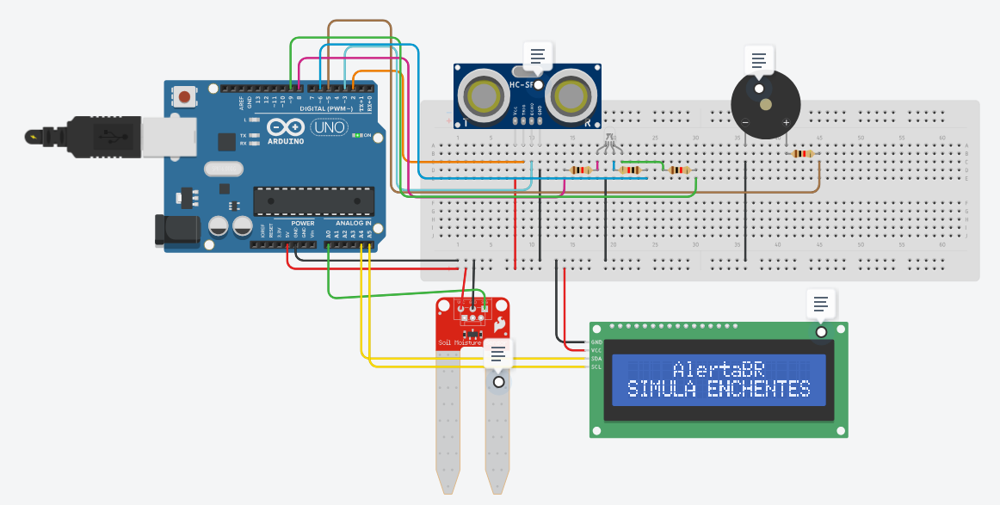

# 🌧️ AlertaBR - Monitoramento de enchentes e deslizamentos
Este projeto foi desenvolvido para o evento da **Global Solution** proposto pela FIAP. Utilizando o arduíno UNO foi montado um **sistema inteligente de alertas para enchentes e deslizamentos de terra**, integrando *sensores de solo, ultrassônicos*, um *display LCD I2C 16x2* e um *buzzer* para avisar quando o nível for crítico. 

<!-- Colocar Link do vídeo do YT quando for lançado -->
### Assista nosso vídeo explicativo 👉 [AlertaBR - Circuito de Enchentes e Umidade](https://youtu.be/_UoHvXk5F6Q)

### 👉 [Acesse o projeto no Tinkercad](https://www.tinkercad.com/things/1KK5NCCKVfm-circuito-global-solution/editel?returnTo=https%3A%2F%2Fwww.tinkercad.com%2Fdashboard)

#### Acesse o código oficial do circuito 👉 [circuit.ino](circuit.ino)

## 👩‍💻 Equipe AlertaBR
* [Luís Felipe Scacchetti](https://github.com/scacchetti07) - RM562241
* [Leonardo Eiji Kina](https://github.com/leo-kina) - RM562241

## 💻 Desenvolvimento

### 🔧 Componentes Utilizados
* 1x **Arduino UNO**
* 1x **Sensor de umidade do solo (analógico)**
* 1x **Sensor ultrassônico HC-SR04**
* 1x **Buzzer**
* 1x **Display LCD I2C 16x2**
* 1x **LED RGB (pinos PWM)**
* **Jumpers e Protoboard**

### ⚙️ Funcionalidades do Circuito
* **Medição do nível da água** com *sensor ultrassônico*
* **Leitura da umidade do solo** com *sensor próprio* para *prever risco* de deslizamento
* Exibição das leituras no *display LCD* com **mensagens contextualizadas**
* Ativação de **alerta sonoro** com o *buzzer* e **visual** com o *LED RGB* em caso de **risco iminente**
    * LED Verde: Seguro
    * LED Amarelo: Alerta
    * LED Vermelho: Crítico

### 🧠 Lógica de Avaliação
| Condição | Estado | Ação |
| ----------- | ----------- | ----------- |
| 💧 Nível da Água (< 1.5m) | Nível Ideal | LED Verde
| 💧 Nível da água (< 2.5m)   | Nível Ok |  LED Amarelo + alerta LCD
| 💧 Nível da água (> 2.5m)      | Nível Crítico | LED Vermelho + buzzer + alerta LCD
| 🪴 Solo seco (< 400) | Solo Ideal | LED Verde
| 🪴 Umidade (< 650) | Solo Úmido | LED Amarelo + alerta LCD
| 🪴 Umidade do solo > 650 | Solo Molhado | LED Vermelho + buzzer + alerta LCD

### 🏧 Lógica de Máquina de Estados

O sistema utilizou a lógica de **máquinas de estado** para organizar e manipular o funcionamento do código, facilitando sua **manutenção e expansão futura**. O funcionamento foi dividido em **3 etapas principais**:

#### 1. **Atribuição de valores dos sensores**  
Atribui os dados retornados do **sensor ultrassônico** (nível da água) e do **sensor de umidade do solo** a **variáveis globais**, que serão utilizadas na etapa de análise.

---

#### 2. **Análise dos valores atribuídos**  
Verifica os valores coletados e **exibe no display LCD** o **estado atual** do nível da água e da umidade do solo, classificando como **ideal**, **alerta** ou **crítico**.

---

#### 3. **Alarme de estados críticos e de alerta**  
Caso seja identificado um risco de **enchente ou deslizamento**, o sistema emite um **alarme sonoro (buzzer)** e **visual (LED RGB ou mensagens no display LCD)** para notificar o usuário.

## ✅ Considerações Finais
Este projeto reforça a importância do uso da **tecnologia como aliada na proteção de vidas em regiões de risco**, especialmente em um país como o Brasil, onde eventos climáticos extremos têm se tornado mais frequentes. Iniciativas como essa mostram o potencial de **soluções simples, escaláveis e com grande impacto social**.

### Acesse mais imagens do circuito 👉 [Demonstração](/assets/) 